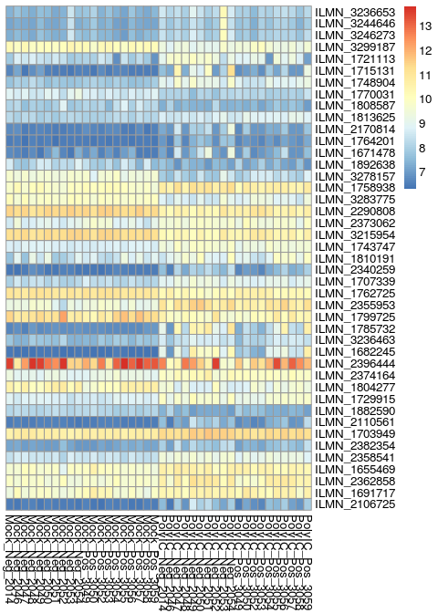
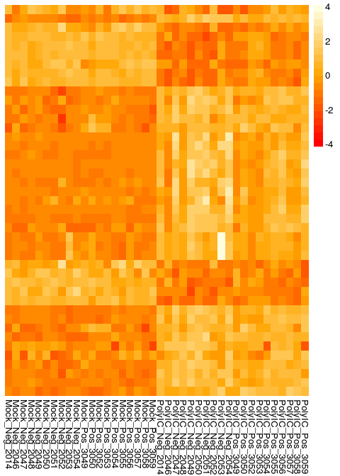
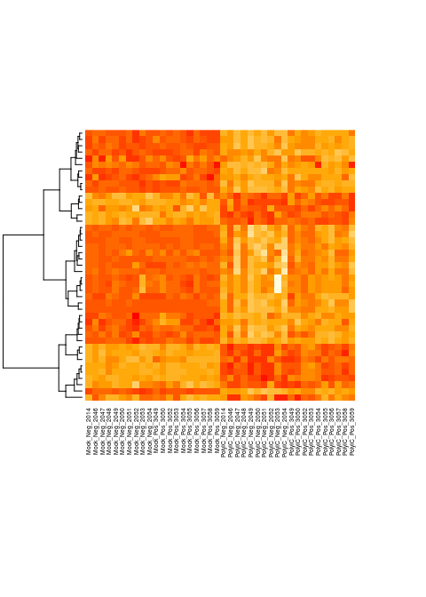
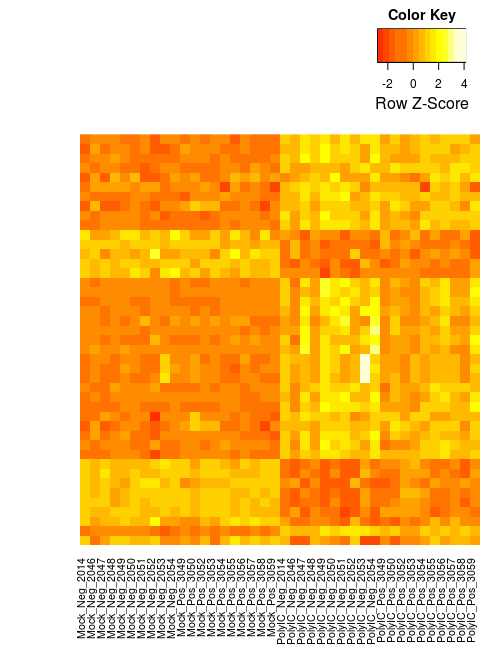

# HW3_gloria_chi
Gloria Chi  

## Assignment

From: [Biostat-578 HW3](https://github.com/raphg/Biostat-578/blob/master/HW3.md):

Reproduce the results presented in 
[Figure 2](http://www.ncbi.nlm.nih.gov/pmc/articles/PMC3571267/figure/F2/) of 
the following paper: 

Qian, F., Bolen, C. R., Jing, C., Wang, X., Zheng, W., Zhao, H., et al. (2013). 
[Impaired toll-like receptor 3-mediated immune responses from macrophages of patients chronically infected with hepatitis C virus.](http://www.ncbi.nlm.nih.gov/pmc/articles/PMC3571267/) 
Clinical and Vaccine Immunology : CVI, 20(2), 146–155. doi:10.1128/CVI.00530-12

You will have to:

1. Get the data from GEO
2. Normalize the data (if necessary)
3. Use limma to test for differential expression
4. Display the results using a heatmap [Hint: Use the pheatmap package]

## Setup `knitr`

Set some global knitr options


```r
library("knitr")
opts_chunk$set(tidy=FALSE, cache=TRUE, messages=FALSE, 
               fig.width=5, fig.height=7)
```

Load libraries


```r
library(GEOquery)
```

```
## Loading required package: Biobase
## Loading required package: BiocGenerics
## Loading required package: parallel
## 
## Attaching package: 'BiocGenerics'
## 
## The following objects are masked from 'package:parallel':
## 
##     clusterApply, clusterApplyLB, clusterCall, clusterEvalQ,
##     clusterExport, clusterMap, parApply, parCapply, parLapply,
##     parLapplyLB, parRapply, parSapply, parSapplyLB
## 
## The following object is masked from 'package:stats':
## 
##     xtabs
## 
## The following objects are masked from 'package:base':
## 
##     Filter, Find, Map, Position, Reduce, anyDuplicated, append,
##     as.data.frame, as.vector, cbind, colnames, do.call,
##     duplicated, eval, evalq, get, intersect, is.unsorted, lapply,
##     mapply, match, mget, order, paste, pmax, pmax.int, pmin,
##     pmin.int, rank, rbind, rep.int, rownames, sapply, setdiff,
##     sort, table, tapply, union, unique, unlist, unsplit
## 
## Welcome to Bioconductor
## 
##     Vignettes contain introductory material; view with
##     'browseVignettes()'. To cite Bioconductor, see
##     'citation("Biobase")', and for packages 'citation("pkgname")'.
## 
## Setting options('download.file.method.GEOquery'='curl')
```

```r
library(Biobase)
library(data.table)
library(beadarray)
```

```
## Loading required package: ggplot2
```

```
## Warning in fun(libname, pkgname): couldn't connect to display ":0"
```

```
## Welcome to beadarray version 2.16.0
## beadarray versions >= 2.0.0 are substantial updates from beadarray 1.16.0 and earlier. Please see package vignette for details
```

```r
library(limma)
```

```
## 
## Attaching package: 'limma'
## 
## The following object is masked from 'package:beadarray':
## 
##     imageplot
## 
## The following object is masked from 'package:BiocGenerics':
## 
##     plotMA
```

```r
library(stringr)
library(pheatmap)
```

## Get data

Get GEO dataset


```r
gds <- getGEO("GSE40812", destdir="./")[[1]]
```

```
## ftp://ftp.ncbi.nlm.nih.gov/geo/series/GSE40nnn/GSE40812/matrix/
## Found 1 file(s)
## GSE40812_series_matrix.txt.gz
## File stored at: 
## .//GPL10558.soft
```

## Clean up data


```r
sanitize_pdata <- function(pd) {
    keepCols <- c("title", "source_name_ch1", "characteristics_ch1", 
                  "characteristics_ch1.2")
    pd <- pd[, keepCols]
    colnames(pd) <- c("ptid", "cell", "inf", "trt") 
    pd$ptid <- gsub("^[A-Z][A-Z][0-9]+_","", pd$ptid)
    pd$ptid <- gsub("[A-z]", "", pd$ptid)
    pd$inf <- gsub("infection status: ", "", pd$inf)
    pd$trt <- gsub("treatment: ", "", pd$trt)
    pd$trt <- gsub("Poly IC H", "PolyIC", pd$trt)
    pd <- pd[pd$cell=="Monocyte-derived Macrophage",]
    pd <- pd[order(pd$ptid),]
}
    
pData(gds) <- sanitize_pdata(pData(gds))
```

## Normalize data


```r
gds <- normaliseIllumina(gds, method='quantile')
```

## Test for differential expression

Get expression matrix

```r
pd <- pData(gds)
ematrix <- exprs(gds[,rownames(pd)])
```

Differential expression analysis for trt

```r
design_trt <- model.matrix(~trt, pd)
fit_trt <- lmFit(ematrix, design_trt)
eb_trt <- eBayes(fit_trt)
tt_trt <- topTable(eb_trt, coef="trtPolyIC", number=Inf, adjust.method="BH")
```

Get probe sets with p-value < 0.05 and fold change > 1.5

```r
tt_trt <- tt_trt[tt_trt$adj.P.Val<0.05 & abs(tt_trt$logFC)>log2(1.5),]
ematrix_trt <- ematrix[row.names(tt_trt),]
```

Calculate fold change for 1146 probes for each subject's mock and poly

```r
fold <- ematrix_trt[, pd$trt=="Mock"]-ematrix_trt[, pd$trt=="PolyIC"]
```

Differential analysis with HCV inf

```r
#subset pData to include unique participants by including those in mock
pd_inf <- pd[pd$trt=="Mock",  c('ptid', 'inf')]
pd_inf <- pd_inf[order(pd_inf$ptid),]
design_inf <- model.matrix(~inf, pd_inf)
fit_inf <- lmFit(fold, design_inf)
eb_inf <- eBayes(fit_inf)
tt_inf <- topTable(eb_inf, coef="infPos", number=Inf)
#get probes for heatmap, there are 43 with p-values < 0.1
hmprobe <- tt_inf[tt_inf$P.Value < 0.1,]
sum(tt_inf$P.Value < 0.1) ## number of probes
```

```
## [1] 43
```

## Display heatmap with `pheatmap`


```r
#get expression matrix for heatmap probes
ematrix_hm <- ematrix[rownames(hmprobe),]
#assign ptid as colnames for ematrix_hm
colnames(ematrix_hm) <- pd$ptid
#reorder treatment and HCV inf
pd <- pd[order(pd$trt, pd$inf, pd$ptid),]
ematrix_hm <- ematrix_hm[,pd$ptid]
#assign more descriptive colnames
colnames(ematrix_hm) <- str_trim(paste(pd$trt, pd$inf, pd$ptid, sep="_"))

pheatmap(ematrix_hm, cluster_rows=F, cluster_cols=F)
```

 

## Display modified heatmap with `pheatmap`

You can use clustering, scaling, and color palette features to approximate the
published figure.


```r
drows <- dist(ematrix_hm, method = "euclidean")
hmcols<-colorRampPalette(c("red", "orange", "lightyellow"))(20)
pheatmap(ematrix_hm, cluster_cols=FALSE, cluster_rows=TRUE, 
         clustering_method="ward", clustering_distance_rows = drows, 
         scale="row", show_rownames=FALSE, border_color=NA, treeheight_row=0, 
         color = hmcols) 
```

```
## The "ward" method has been renamed to "ward.D"; note new "ward.D2"
```

 

## Display heatmap with `heatmap`

Using the `heatmap` function from the stats package will allow you to get 
even closer to the published figure.


```r
library(stats)
hmcols<-colorRampPalette(c("red", "orange", "lightyellow"))(20)
heatmap(ematrix_hm, Colv=NA, labRow=NA, keep.dendro=FALSE, 
        hclustfun=function(d) hclust(d, method="ward.D2"),
        distfun=function(x) dist(x, method="euclidean"),  
        cexRow=0.5, cexCol=0.5, col=hmcols)
```

 

## Display heatmap with `heatmap.2`

To get the same color key shown in the published figure, we can use the 
`heatmap.2` function from the gplots package. However, to get the key to show 
on the upper-right, aligned with the right edge of the heatmap requires some 
layout and margin adjustments.


```r
library(gplots)
```

```
## 
## Attaching package: 'gplots'
## 
## The following object is masked from 'package:stats':
## 
##     lowess
```

```r
hclust.ward <- function(x) hclust(x, method="ward.D2")
dist.eucl <- function(x) dist(x, method="euclidean")
heatmap.2(ematrix_hm, scale="row", dendrogram = "none",  
          symkey=FALSE, density.info="none", trace="none", 
          cexRow=0.7, cexCol=1, margins=c(10,0), labRow=FALSE, 
          lmat=rbind( c(0, 3, 4), c(2,1,1) ), lwid=c(1, 3, 2), 
          hclustfun=hclust.ward, distfun=dist.eucl, Colv=NA, 
          key=TRUE, keysize=1.0)
```

 
